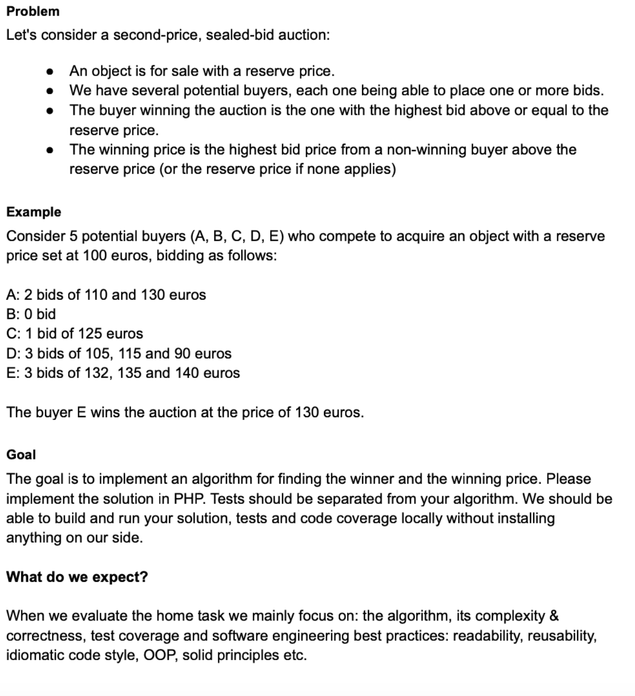

# Auction algorithm test task

This project is about resolving the test task described below.
Please read the developer notes before making conclusions, also please check inline comments.
Task description is provided as picture to do not index it by google.

### Task description


### Getting started with project
1. If not already done, [install Docker Compose](https://docs.docker.com/compose/install/) (v2.10+)
2. Run `docker compose build --pull --no-cache` to build fresh images
3. Run `docker compose up` (the logs will be displayed in the current shell)
4. Run `docker-compose exec php vendor/bin/phpunit --coverage-text` to run all tests with coverage report (xdebug is in place ;) ) 
5. Run `docker-compose exec php bin/console bid:get-winning 1` to get the result of auction based on fixtures (same as example) (id could be different if you were having troubles with DB population)

### Developer notes

* Because of goal is to implement algorithm in PHP - I've skipped the database solution, that could be less optimized by the sql query processing, sorting and grouping algorithms, but that is very fast and readable solution, so all the results could be fetched from this query. From my POV that will be the best solution, top readability and supportability, but could make troubles on high load

```sql
SELECT buyer_id, MAX(value) as value
FROM bid
WHERE position_id = 1
GROUP BY buyer_id
HAVING MAX(value) > 100
ORDER BY value DESC
LIMIT 2;
```
* The advantages, disadvantages and other comments related to algorithms are described in algorithms class comments
  * [Performance optimized algorithm](src/Service/Strategy/SecondPriceSealedBidPerformanceOptimizedStrategy.php)
  * [Readability optimized algorithm](src/Service/Strategy/SecondPriceSealedBidReadabilityOptimizedStrategy.php)
* Because of focus of the task is algorithm - I can not show my knowledge of building layered DDD applications and principals fully. I've added some additional code as a preview
  * By description, we can skip database relations, structuring of models, but I've created simple DB structure as if that project real just to show that I can work with data layer. Data is populated by [Fixtures](src/DataFixtures)
  * This test task could be situated outside of framework, but I believe that it is very important to show that I could use latest symfony framework + setup env for full-cycle of development (even Xdebug with latest version)
  * By description the application layer is not required, but I've created a console command to process result
* I could do more code quality by using php-md, php-cs, or other static code analyzers but for this task I was using none of them
* Most of the core code (Entities, Repositories, Commands) are generated by using symfony/maker-bundle
* It's bad to use entities inside the service layer, I prefer to use immutable DTO, just cut-off that because of time and missing layering
* Some validation are skipped (AuctionPosition has >= 2 buyers, something like that)
* To increase code coverage I prefer to use application tests, functional tests also good for increasing coverage, but there is no app layer by description, so there are only [pure UNIT tests](tests/Service/Strategy) in place, that is actually very good to have for such type of tasks (I mean algorithms)

### References to goals

* Algorithms and the complexity (could be found inside class comments)
  * [Performance optimized algorithm](src/Service/Strategy/SecondPriceSealedBidPerformanceOptimizedStrategy.php)
  * [Readability optimized algorithm](src/Service/Strategy/SecondPriceSealedBidByRoundStrategy.php)
  * [Additional performance optimized algorithm, that could show results by rounds](src/Service/Strategy/SecondPriceSealedBidByRoundStrategy.php)
  * [Additional Biggest Bid optimized algorithm](src/Service/Strategy/BiggestBidStrategy.php)
* Correctness could be checked by running [Tests](tests/Service/Strategy)
* To show that project could be reusable - I've tweaked code to have things like:
  * I\O command DTO's that inherits [Interfaces like this](src/Structure/WinnerBid/WinnerBidInterface.php)
  * Dynamic [Factories](src/Service/Factory/AuctionAlgorithmStrategyFactory.php) and [Strategies](src/Service/Strategy/AuctionStrategyInterface.php)
  * Inheritance of [Strategies that is similar by definition](src/Service/Strategy/SecondPriceSealedBidByRoundStrategy.php) 
  * Extendable framework solution
* Code style is symfony and industry default PSR-12 (didnt use csfixer for that, but looks good)
* Some of the features from the latest PHP version used, like match or ?->, some of them skipped by my taste, like definition in constructors
* It's hard to fully show OOP when the task description limits me to one algorithm, but I am very skilled on that, just believe =) You could look at services settings, DI and entities usages across all the app
* SOLID examples are:
  * S could be found across all of the app. It can me more decomposed (like builder services instead of new model creation inside FacadeService methods, or sorting algorithms as a strategy implementation) but there is no reason to do that for such a small amount of functionality
  * O is implemented by the Factories implementation of [WinnerBidSelector code](src/Service/WinnerBidSelector.php). You could add new strategies and parameters of auctions (a structure of bids and other things required by algorithms) by just creation of new classes that implements interfaces for similar object, WinnerBidSelector will not be changed during this extension
  * L could also being found in same [WinnerBidSelector code](src/Service/WinnerBidSelector.php) - replacing the algorithms will not affect the app
  * I is impossible to show without a big variety of interfaces, but I like to split interfaces by contexts for sure
  * D is hard to show in a not layered apps, but there is no dependencies in low-level code from high level params. For example - there will be a mistake to group [This algorithm](src/Service/Strategy/SecondPriceSealedBidPerformanceOptimizedStrategy.php) and [This Algorithm](src/Service/Strategy/SecondPriceSealedBidByRoundStrategy.php) with the same Parameter classes - we will move the knowladge of HL stuff inside LL calculations

**Enjoy! Full task completed in less then 10 hours non-stop programming from scratch. I will be happy to hear extended feedback =)**
